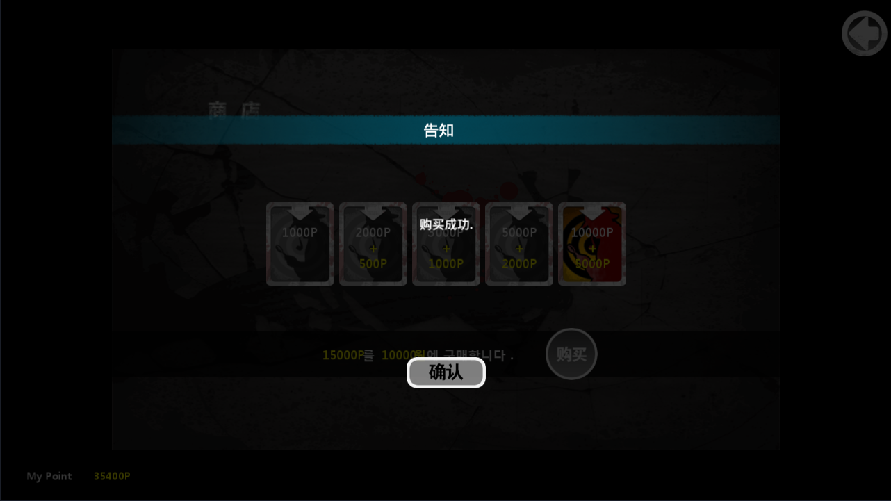
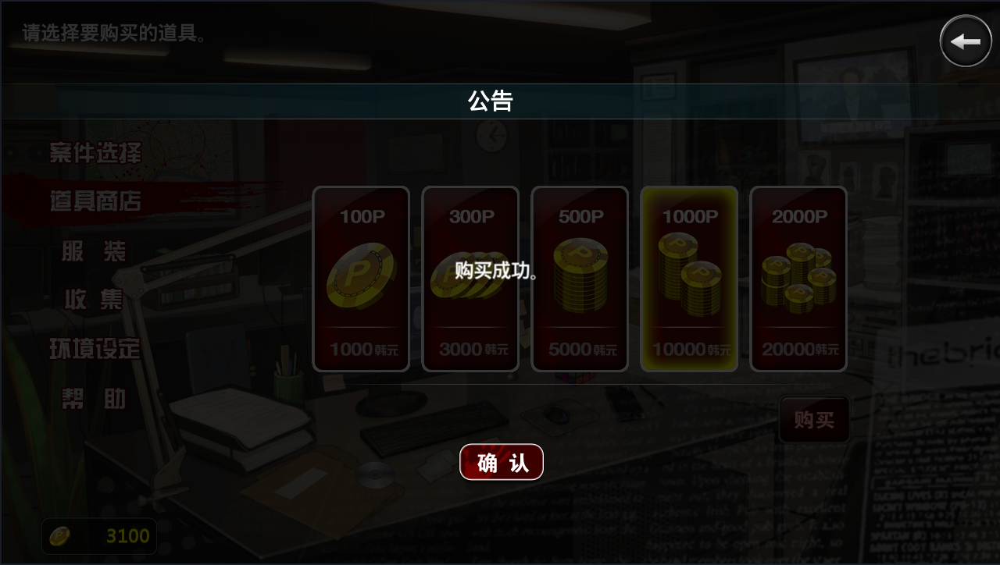

# 口袋侦探内购破解

口袋侦探是由韩国NFLY STUDIO于2013年左右推出的手机游戏，分为1、2两部。

本项目在口袋汉化组的安卓汉化版本基础上，对游戏中的商店功能进行了破解。

## 使用方法

口袋侦探只能在旧版安卓4上运行，可以在这里下载安卓4版本的雷电模拟器：

http://res.ldmnq.com/download/1.9.1/ldinst_1.9.1.exe

在Release页面下载破解后的口袋侦探APK安装包：

https://github.com/JackNoire/InfinitePrivateEye_CHS/releases

建议分辨率：

口袋侦探1：960 x 576

口袋侦探2：1280 x 720

如果想自己将项目打包成APK文件，使用以下命令对口袋侦探1与口袋侦探2进行重打包与签名：

```
cd koudaizhentan

apktool b .

cd dist

keytool -genkey -v -keystore my-release-key.keystore -alias cert -keyalg RSA -keysize 2048 -sigalg SHA1withRSA -validity 10000

jarsigner -verbose -sigalg SHA1withRSA -digestalg SHA1 -keystore my-release-key.keystore koudaizhentan.apk cert
```

```
cd koudaizhentan2

apktool b .

cd dist

keytool -genkey -v -keystore my-release-key.keystore -alias cert -keyalg RSA -keysize 2048 -sigalg SHA1withRSA -validity 10000

jarsigner -verbose -sigalg SHA1withRSA -digestalg SHA1 -keystore my-release-key.keystore koudaizhentan2.apk cert
```

**建议使用Java jdk1.8.0_202版本中的keytool和jarsigner**，使用太新的版本，可能导致APK无法安装，报错：INSTALL_PARSE_FAILED_UNEXPECTED_EXCEPTION

## 运行截图





## 破解思路

[口袋侦探1安卓内购破解流程 - JackNoire's Blog](https://jacknoire.github.io/2024/02/22/crack-koudaizhentan-1/)

[口袋侦探2安卓内购破解流程 - JackNoire's Blog](https://jacknoire.github.io/2024/02/22/crack-koudaizhentan-2/)
